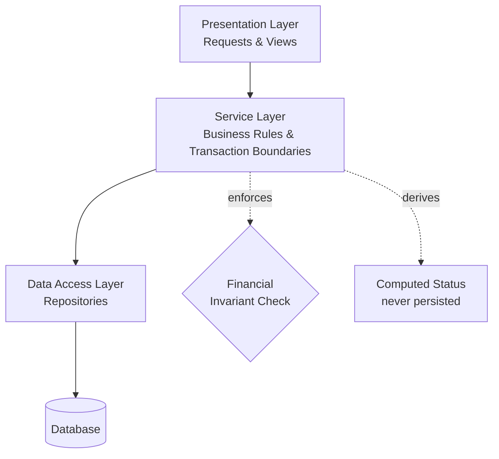

# Enterprise Invoice Management System — An Engineering Case Study


Most tutorials teach you to store data correctly. Production financial systems exist to make it *impossible to store incorrect financial data* — and that one shift in ambition changes almost every decision an engineer makes.

This repository is a case study in **financial integrity**: an enterprise invoice management platform where the interesting engineering problem was never "display a list of invoices," but "guarantee that no combination of them can ever silently violate what the business actually committed to." Every chapter that follows — architecture, security, scalability, trade-offs — is really the same question asked from a different angle: *how do you keep a number honest while everything around it keeps changing?* It's not a runnable application. It's the reasoning, written the way a senior engineer would explain it to the person taking over the system.

> **Correctness is the product.** Everything else in this repository is in service of that one sentence.

### At a Glance

**Business**
- Vendor and purchase commitment tracking
- Multi-invoice reconciliation against a single commitment
- Settlement and payment-aging visibility

**Architecture**
- Layered, server-rendered enterprise design
- Domain organized around master vs. transactional data
- Service-owned business logic and transaction boundaries

**Engineering**
- Financial invariant enforcement across related records
- Computed, derived state instead of persisted status fields
- Two-layer authorization
- Design patterns and trade-offs, examined honestly

> **If you only read one document in this repository, read [Design Decisions](docs/05-design-decisions.md).** It's where every other chapter's reasoning ultimately comes from. After that, [System Architecture](docs/02-system-architecture.md), then [Business Workflows](docs/03-business-workflows.md) — see [Section 10](#10-documentation-roadmap) for how the rest is prioritized.

---

## Table of Contents

1. [Project Overview](#1-project-overview)
2. [Why This Repository Exists](#2-why-this-repository-exists)
3. [Engineering Philosophy](#3-engineering-philosophy)
4. [What Makes This Case Study Different?](#4-what-makes-this-case-study-different)
5. [Learning Outcomes](#5-learning-outcomes)
6. [Key Engineering Topics Covered](#6-key-engineering-topics-covered)
7. [Repository Structure](#7-repository-structure)
8. [Architecture Highlights](#8-architecture-highlights)
9. [Core Engineering Concepts](#9-core-engineering-concepts)
10. [Documentation Roadmap](#10-documentation-roadmap)
11. [Diagram Index](#11-diagram-index)
12. [Reference Implementations](#12-reference-implementations)
13. [Articles](#13-articles)
14. [Intended Audience](#14-intended-audience)
15. [Repository Goals](#15-repository-goals)
16. [Disclaimer](#16-disclaimer)
17. [Future Improvements](#17-future-improvements)
18. [Final Thoughts](#18-final-thoughts)

---

## 1. Project Overview

A purchase is a promise: a commitment made to a vendor for a fixed amount. What arrives afterward — one invoice, or several, spread over time — has to add up to exactly that promise, never more. This repository documents a system built to enforce that automatically, at the moment each invoice is entered, without a human ever needing to manually check a running total.

No approval chains. No sign-off gates. Nobody has to remember to check anything, because the system was built so there's nothing left for a human to remember. That's the whole engineering thesis in one sentence: move the guarantee out of someone's diligence and into the architecture itself. [`docs/00-overview.md`](docs/00-overview.md) opens the full story; this page is the invitation.

---

## 2. Why This Repository Exists

Most engineering tutorials teach CRUD — create a record, read it back, update it, delete it. Production line-of-business software rarely gets to stay that simple. It has to survive concurrent writes without silently breaking an invariant, decide which data deserves a permanent history and which doesn't, and stay correct while an organization's structure shifts underneath it.

Those problems don't show up in a weekend project. They show up after a system has been in production for a while, with real money and real vendors depending on it being right. And they're rarely taught, because a tutorial that stopped to explain "here's what happens when two invoices try to exceed a purchase's value at the same instant" would stop feeling like a tutorial. It would start feeling like the actual job.

This repository exists to talk about that job honestly. Not the parts that make a good demo — the parts that make a system trustworthy after eighteen months of real use, when the people who built it have moved on and the only thing left speaking for their decisions is the system itself.

---

## 3. Engineering Philosophy

Enterprise software is rarely constrained by technology. It is constrained by correctness.

Frameworks change. Databases change. Architectures evolve. What has to survive all of that is the business truth underneath — the fact that a purchase for a fixed amount cannot, under any sequence of events, end up settled for more than it was worth. A framework migration should never be able to threaten that fact. If it can, the guarantee was never really architectural — it was a habit, and habits don't survive being inherited by someone else's team.

That's the test this repository keeps returning to: not "does the code work," but "does the *system* make it hard to be wrong." Good architecture is mostly the accumulation of boring decisions, made consistently, at the layer where they can't be quietly skipped. Every chapter that follows is an attempt to show that accumulation happening, one decision at a time.

---

## 4. What Makes This Case Study Different?

Unlike many architecture write-ups that describe *what* a system does, this repository asks *why* it was built that way — and, just as often, why the obvious alternative wasn't chosen. Every major chapter is organized around one guiding engineering question rather than a technology or framework, because frameworks are the part of a system most likely to be gone in five years. The reasoning underneath them usually isn't.

Instead of implementation details, it explores architectural reasoning, design trade-offs, business invariants, scalability decisions, and long-term maintainability. Systems rarely fail because a team was missing some piece of technology. They fail because an assumption quietly stopped being true, and nothing in the architecture was positioned to notice.

---

## 5. Learning Outcomes

A reader who works through this repository should come away able to:

- Explain how a financial invariant spanning multiple records is enforced correctly, including under concurrent writes.
- Describe the trade-off between computed and persisted state, and when each is the right tool.
- Distinguish master data from transactional data, and articulate why they might reasonably have different audit strategies.
- Design a layered authorization scheme that separates "can this user reach this feature" from "can this user act on this specific record."
- Read and reason about a layered, server-rendered architecture, including where transaction boundaries belong and why.
- Evaluate a system's scalability constraints from its query and aggregation patterns.
- Name recurring engineering tensions independent of any one system's resolution of them.
- Discuss, in an interview setting, concrete design decisions with their trade-offs rather than only their surface-level description.

---

## 6. Key Engineering Topics Covered

Every topic below is really the same idea wearing a different hat: protect one financial fact from every possible way the system could let it drift.

| Topic | What this repository explores |
|---|---|
| Layered architecture for financial systems | Why a conventional layered, server-rendered application fits a problem whose difficulty is correctness, not interactivity |
| Financial invariant enforcement | Guaranteeing a business rule that spans several records, checked at the moment of write |
| Computed vs. persisted state | Deriving status on every read instead of maintaining a field that can drift out of sync |
| Master data vs. transactional data | Why some data earns a full change history and some doesn't — and what that costs |
| Two-layer authorization | A coarse, role-based check plus a narrower, record-level one, and where the two can drift apart |
| Analytical dashboards over transactional data | Keeping reporting concerns from leaking into the transactional model |
| Design patterns in enterprise systems | Repository, Service Layer, DTO, and Transaction Script, as they actually appear in a working system |
| Scalability | Where a server-rendered, monolithic application meets its natural performance ceilings |
| Engineering trade-offs | Recurring tensions treated as transferable lessons, independent of how this system resolved them |

---

## 7. Repository Structure

```
enterprise-invoice-case-study/
├── docs/                       Reference documentation, one guiding question per file
├── diagrams/                   Architecture, domain, and workflow diagrams
├── articles/                   Standalone long-form engineering essays
├── reference-implementations/  Small, runnable, purpose-written code samples
├── assets/                     Supporting images and static files
├── .github/                    Issue and pull request templates
├── README.md                   This document
├── CHANGELOG.md                Notable changes to the repository itself
├── CONTRIBUTING.md             How to propose changes to this documentation
├── ROADMAP.md                  Planned additions to the repository
└── FAQ.md                      Answers to recurring questions about this project
```

Four folders, four different ways of saying the same thing: `docs/` argues for it, `diagrams/` shows it, `articles/` tells it as a story, `reference-implementations/` proves it compiles. See [Section 10](#10-documentation-roadmap) for how `docs/` is prioritized, and Sections 11–13 for the other three.

---

## 8. Architecture Highlights

The system follows a conventional layered architecture. That's deliberate — the engineering interest here isn't an exotic topology, it's how carefully a small number of guarantees were enforced *within* that ordinary shape. Every abstraction has a maintenance cost; this system spent its budget on the one abstraction that mattered and left the rest plain on purpose.



Every request passes through one presentation layer, one service layer, one data-access layer — no shortcuts between them. An architecture is a bet about which parts of a system will need to change and which won't; this one bet that the invariant would never be optional, and built the one layer that can't be bypassed around enforcing it.

Four decisions carry most of the weight, each explored fully elsewhere rather than here:

- **A financial invariant, enforced at write time — not reconciled after the fact.** [`docs/05-design-decisions.md`](docs/05-design-decisions.md)
- **Status as something derived, never stored — state that has to be kept in sync is state that eventually falls out of sync.** [`docs/03-business-workflows.md`](docs/03-business-workflows.md)
- **Reference data with history; transactional data without — a real trade-off, not an oversight.** [`docs/01-business-domain.md`](docs/01-business-domain.md)
- **Authorization checked at two independent layers — because it's a question worth asking twice, in two different ways.** [`docs/04-security-model.md`](docs/04-security-model.md)

---

## 9. Core Engineering Concepts

> **A note on how to read this repository.** Each concept above is explored in full in `docs/`, illustrated visually in `diagrams/`, told as a standalone story in `articles/`, and — where it lends itself to a small code example — implemented generically in `reference-implementations/`. Four lenses, one set of ideas; nothing here is re-explained, only re-approached.

- Financial invariant enforcement across related records
- Computed state vs. persisted state
- Master data with history, transactional data without
- Layered authorization
- Analytical views over transactional data
- Engineering trade-offs as a transferable lens, independent of domain

---

## 10. Documentation Roadmap

Every document in this repository orbits the same idea from a different angle. Read the ★★★★★ tier first — it's where the reasoning actually lives; everything else elaborates on a decision made there.

| Priority | Document | Chapter theme | Guiding question |
|---|---|---|---|
| ★★★★★ | [`docs/05-design-decisions.md`](docs/05-design-decisions.md) | Architectural decisions that protect financial integrity | Why were these specific decisions made, and what did each cost? |
| ★★★★★ | [`docs/02-system-architecture.md`](docs/02-system-architecture.md) | Designing an architecture around correctness | Why is this architecture appropriate for a financial system? |
| ★★★★★ | [`docs/03-business-workflows.md`](docs/03-business-workflows.md) | Modeling financial commitments and reconciliation | Why is reconciliation harder than it first appears? |
| ★★★★☆ | [`docs/04-security-model.md`](docs/04-security-model.md) | Authorization as an integrity boundary | Why is authorization a bigger problem than authentication? |
| ★★★★☆ | [`docs/06-architecture-trade-offs.md`](docs/06-architecture-trade-offs.md) | Correctness, consistency, and cost | What engineering tensions recur here, independent of how they were resolved? |
| ★★★★☆ | [`docs/07-scalability.md`](docs/07-scalability.md) | Scaling without compromising integrity | When does this architecture stop working, and what gives first? |
| ★★★☆☆ | [`docs/00-overview.md`](docs/00-overview.md) | Why financial integrity is harder than CRUD | Why do organizations need this class of software at all? |
| ★★★☆☆ | [`docs/01-business-domain.md`](docs/01-business-domain.md) | Modeling commitments, not just records | Why is this domain modeled this way? |
| ★★★☆☆ | [`docs/10-engineering-patterns.md`](docs/10-engineering-patterns.md) | Patterns that transfer beyond this system | Which patterns here transfer to other systems? |
| ★★★☆☆ | [`docs/08-lessons-learned.md`](docs/08-lessons-learned.md) | What this system taught about building financial software | What would a second pass do differently? |
| ★★★☆☆ | [`docs/11-system-evolution.md`](docs/11-system-evolution.md) | Reading intent into an unfamiliar codebase | How should an engineer read structural signals in *any* unfamiliar codebase? |
| — | [`docs/09-interview-guide.md`](docs/09-interview-guide.md) | Standing reference | What should an interviewer expect a candidate to be able to explain? |
| — | [`docs/glossary.md`](docs/glossary.md) | Standing reference | Definitions of every term used consistently across this repository |

---

## 11. Diagram Index

| Diagram | Shows |
|---|---|
| [`diagrams/architecture.md`](diagrams/architecture.md) | The layered architecture and where its boundaries sit |
| [`diagrams/database-er.md`](diagrams/database-er.md) | Conceptual entities and their relationships |
| [`diagrams/workflow.md`](diagrams/workflow.md) | The purchase-to-settlement reconciliation flow |
| [`diagrams/state-machine.md`](diagrams/state-machine.md) | The computed status states for a purchase and for an invoice |
| [`diagrams/security-flow.md`](diagrams/security-flow.md) | The two authorization layers and where each applies |
| [`diagrams/dashboard-flow.md`](diagrams/dashboard-flow.md) | How role-scoped queries feed an analytical dashboard |
| [`diagrams/reconciliation-sequence.md`](diagrams/reconciliation-sequence.md) | A purchase and its invoices, from creation through the invariant check to settlement |

---

## 12. Reference Implementations

Small, self-contained, runnable code samples — not excerpts from any production system. Each demonstrates one pattern clearly, stripped of everything that would obscure it. The best kind of business rule is the one a developer can't accidentally forget to enforce; these are small attempts at that.

| Reference implementation | Pattern demonstrated |
|---|---|
| [`reference-implementations/derived-status-calculator/`](reference-implementations/derived-status-calculator/README.md) | Computing a record's status from its underlying data instead of persisting a separate status field |
| [`reference-implementations/financial-invariant-validator/`](reference-implementations/financial-invariant-validator/README.md) | Enforcing that a set of related records can never together exceed a value fixed on their parent |
| [`reference-implementations/layered-authorization-example/`](reference-implementations/layered-authorization-example/README.md) | Combining a coarse-grained access check with a fine-grained, record-level recheck |

---

## 13. Articles

| Article | Summary |
|---|---|
| [`articles/01-why-every-guarantee-has-a-cost.md`](articles/01-why-every-guarantee-has-a-cost.md) | Every guarantee a system keeps is paid for in coupling, computation, or latency — never for free |
| [`articles/02-computed-state-vs-stored-state.md`](articles/02-computed-state-vs-stored-state.md) | Why a stored status field needs every future writer to remember to update it, and a computed one can't go stale |
| [`articles/03-why-authorization-needs-two-different-questions.md`](articles/03-why-authorization-needs-two-different-questions.md) | Why "can this role reach this feature" and "can this user act on this record" are different questions |
| [`articles/04-the-difference-between-a-trade-off-and-a-mistake.md`](articles/04-the-difference-between-a-trade-off-and-a-mistake.md) | A trade-off is a decision with its assumption written down; a mistake is the same decision made silently |
| [`articles/05-reading-an-unfamiliar-codebase-by-its-guarantees.md`](articles/05-reading-an-unfamiliar-codebase-by-its-guarantees.md) | How to read a codebase by where it spent extra complexity, not file by file |
| [`articles/06-why-single-ownership-beats-duplicate-business-rules.md`](articles/06-why-single-ownership-beats-duplicate-business-rules.md) | Why two copies of the same rule will drift, even without anyone making a mistake |
| [`articles/07-expiration-conditions-the-missing-piece.md`](articles/07-expiration-conditions-the-missing-piece.md) | Why "we'll revisit this later" almost never happens without a specific, checkable trigger |

---

## 14. Intended Audience

- **Backend and full-stack engineers** who want to study a realistic financial/enterprise system rather than a toy example.
- **Engineers preparing for technical interviews**, particularly ones covering system design, data modeling, or enterprise architecture.
- **Engineering managers and architects** evaluating how these patterns might apply to their own procurement, billing, or reconciliation systems.
- **Students and early-career engineers** looking for a worked example that goes beyond CRUD tutorials into genuine financial-integrity modeling.

This repository assumes familiarity with general backend web development concepts (HTTP, relational databases, MVC) but not prior exposure to enterprise Java conventions specifically — they're explained from first principles where they appear.

---

## 15. Repository Goals

This repository is intentionally written so that its engineering lessons remain valuable even if you've never worked on a financial system. It is a demonstration of how experienced engineers reason about correctness, consistency, scalability, and long-term maintainability when designing enterprise software — using financial integrity as the thread that ties every chapter together, not as the limit of where the lessons apply.

The goal is not to present a flawless system, but an honest one — its strengths, its trade-offs, and the places a second pass would improve it — documented with the same rigor a senior engineer would apply when handing a system off to a new team.

---

## 16. Disclaimer

> This repository is an educational engineering case study, inspired by engineering patterns commonly found in enterprise financial and procurement systems. It does not contain, reference, or reproduce any proprietary source code, database schema, configuration, or business data from any real system or organization.
>
> Every entity, workflow, role, and example described here has been independently designed to illustrate general engineering concepts in isolation. Where a reference implementation is provided, it is original, purpose-written code created to demonstrate a single pattern clearly — it is not an excerpt, adaptation, or derivative of any production codebase.
>
> The engineering concepts, design patterns, and architectural lessons documented here are general knowledge, applicable to any system that tracks a financial commitment against claims made on it. No company, product, or individual is identified or referenced anywhere in this repository.

---

## 17. Future Improvements

This repository is under active development. Planned additions, tracked in full in [`ROADMAP.md`](ROADMAP.md), include:

- **An event-driven variant** — how this design would change under domain events and eventual consistency instead of a layered monolith's synchronous invariant check.
- **A CQRS discussion** — separating the write model (invariant enforcement) from the read model (analytical dashboards), and whether this system's current mixing of the two is a cost worth paying.
- Interactive versions of the state and sequence diagrams.
- A minimal, runnable reference implementation combining the invariant validator and status calculator into one small worked example.

Suggestions and corrections are welcome — see [`CONTRIBUTING.md`](CONTRIBUTING.md) for how to propose changes.

---

## 18. Final Thoughts

Every technology in this repository will eventually be replaced. The service layer will get rewritten, the database will get swapped, the framework will hit end-of-life and get migrated away from — all of that is normal, and none of it is the point.

What shouldn't change is the fact underneath: a purchase for a fixed amount should never quietly settle for more than it was worth. Everything in this repository is one long argument for building that fact into the architecture, rather than trusting it to a person's diligence — because diligence doesn't survive being inherited, and architecture, done well, does.

Every enterprise system is protecting something. Sometimes it's money. Sometimes it's a medical record, a legal filing, an inventory count that a warehouse full of people depend on being right. The technologies change every few years. The responsibility never does.

Software changes. The discipline of protecting a fact from every way it could go wrong doesn't.

Enterprise software is ultimately about deciding what must never become untrue.
