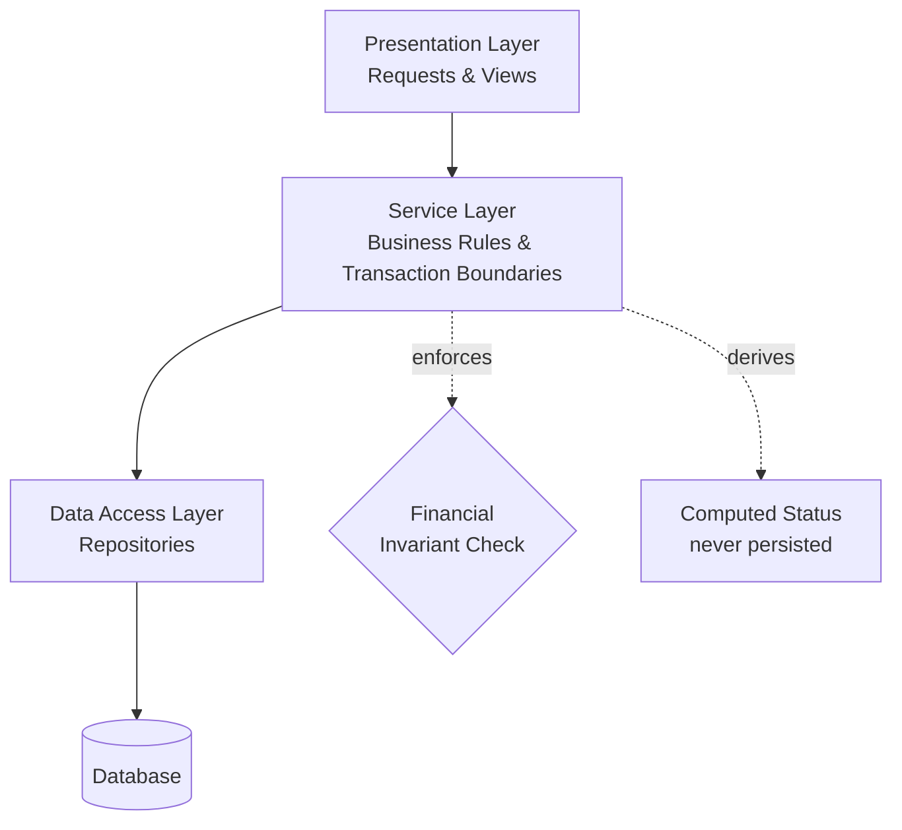

# Enterprise Invoice Management System — An Engineering Case Study


Most tutorials teach you to store data correctly. Production financial systems exist to make it *impossible to store incorrect financial data* — and that one shift in ambition changes almost every decision an engineer makes.

This repository is a case study of a system built around that shift: an enterprise invoice management platform, where the interesting engineering problem was never "display a list of invoices," but "guarantee that no combination of them can ever silently violate what the business actually committed to." It's not a runnable application. It's the architecture, the decisions, and the trade-offs — written the way a senior engineer would explain them to the person taking over the system.

> **Correctness is the product.** Everything else in this repository is in service of that one sentence.

### At a Glance

**Business**
- Vendor and purchase commitment tracking
- Multi-invoice reconciliation against a single commitment
- Settlement and payment-aging visibility

**Architecture**
- Layered, server-rendered enterprise design
- Domain organized around master vs. transactional data
- Service-owned business logic and transaction boundaries

**Engineering**
- Financial invariant enforcement across related records
- Computed, derived state instead of persisted status fields
- Two-layer authorization
- Design patterns and trade-offs, examined honestly

> **New to the repository?** Start with [Design Decisions](docs/05-design-decisions.md), then [System Architecture](docs/02-system-architecture.md), then [Business Workflows](docs/03-business-workflows.md). Those three carry the most engineering weight in the repository — see [Section 10](#10-documentation-roadmap) for how every document is prioritized.

---

## Table of Contents

1. [Project Overview](#1-project-overview)
2. [Why This Repository Exists](#2-why-this-repository-exists)
3. [Engineering Philosophy](#3-engineering-philosophy)
4. [What Makes This Case Study Different?](#4-what-makes-this-case-study-different)
5. [Learning Outcomes](#5-learning-outcomes)
6. [Key Engineering Topics Covered](#6-key-engineering-topics-covered)
7. [Repository Structure](#7-repository-structure)
8. [Architecture Highlights](#8-architecture-highlights)
9. [Core Engineering Concepts](#9-core-engineering-concepts)
10. [Documentation Roadmap](#10-documentation-roadmap)
11. [Diagram Index](#11-diagram-index)
12. [Reference Implementations](#12-reference-implementations)
13. [Articles](#13-articles)
14. [Intended Audience](#14-intended-audience)
15. [Repository Goals](#15-repository-goals)
16. [Disclaimer](#16-disclaimer)
17. [Future Improvements](#17-future-improvements)

---

## 1. Project Overview

A purchase is a promise: a commitment made to a vendor for a fixed amount. What arrives afterward — one invoice, or several, spread over time — has to add up to exactly that promise, never more. This repository documents a system built to enforce that automatically, at the moment each invoice is entered, without a human ever needing to manually check a running total.

No approval chains. No sign-off gates. The engineering weight here sits in data integrity, computed state, and the two-layer authorization that keeps an organizational structure honest. [`docs/00-overview.md`](docs/00-overview.md) opens the full story; this page is the invitation.

---

## 2. Why This Repository Exists

Most engineering tutorials teach CRUD — create a record, read it back, update it, delete it. Production line-of-business software rarely gets to stay that simple. It has to survive concurrent writes without silently breaking an invariant, decide which data deserves a permanent history and which doesn't, and stay correct while an organization's structure shifts underneath it.

Those problems don't show up in a weekend project. They show up after a system has been in production for a while, with real money and real vendors depending on it being right. This repository exists to talk about that class of problem honestly — what it costs, where it's easy to get wrong, and what a system built to take it seriously actually looks like.

---

## 3. Engineering Philosophy

Enterprise software is rarely constrained by technology. It is constrained by correctness.

Frameworks change. Databases change. Architectures evolve. The difficult part is preserving business truth while everything else around it does.

Every chapter in this repository is written through that lens.

---

## 4. What Makes This Case Study Different?

Unlike many architecture write-ups that describe *what* a system does, this repository focuses on *why* it was designed that way. Every major chapter is organized around one guiding engineering question rather than a technology or framework.

Instead of documenting implementation details, it explores architectural reasoning, design trade-offs, business invariants, scalability decisions, and long-term maintainability — the things that are still true after the specific framework has been replaced twice.

---

## 5. Learning Outcomes

A reader who works through this repository should come away able to:

- Explain how a financial invariant spanning multiple records is enforced correctly, including under concurrent writes.
- Describe the trade-off between computed and persisted state, and when each is the right tool.
- Distinguish master data from transactional data, and articulate why they might reasonably have different audit strategies.
- Design a layered authorization scheme that separates "can this user reach this feature" from "can this user act on this specific record."
- Read and reason about a layered, server-rendered architecture, including where transaction boundaries belong and why.
- Evaluate a system's scalability constraints from its query and aggregation patterns.
- Name recurring engineering tensions independent of any one system's resolution of them.
- Discuss, in an interview setting, concrete design decisions with their trade-offs rather than only their surface-level description.

---

## 6. Key Engineering Topics Covered

| Topic | What this repository explores |
|---|---|
| Layered architecture for financial systems | Why a conventional layered, server-rendered application fits a problem whose difficulty is correctness, not interactivity |
| Financial invariant enforcement | Guaranteeing a business rule that spans several records, checked at the moment of write |
| Computed vs. persisted state | Deriving status on every read instead of maintaining a field that can drift out of sync |
| Master data vs. transactional data | Why some data earns a full change history and some doesn't — and what that costs |
| Two-layer authorization | A coarse, role-based check plus a narrower, record-level one, and where the two can drift apart |
| Analytical dashboards over transactional data | Keeping reporting concerns from leaking into the transactional model |
| Design patterns in enterprise systems | Repository, Service Layer, DTO, and Transaction Script, as they actually appear in a working system |
| Scalability | Where a server-rendered, monolithic application meets its natural performance ceilings |
| Engineering trade-offs | Recurring tensions treated as transferable lessons, independent of how this system resolved them |

---

## 7. Repository Structure

```
enterprise-invoice-case-study/
├── docs/                       Reference documentation, one guiding question per file
├── diagrams/                   Architecture, domain, and workflow diagrams
├── articles/                   Standalone long-form engineering essays
├── reference-implementations/  Small, runnable, purpose-written code samples
├── assets/                     Supporting images and static files
├── .github/                    Issue and pull request templates
├── README.md                   This document
├── CHANGELOG.md                Notable changes to the repository itself
├── CONTRIBUTING.md             How to propose changes to this documentation
├── ROADMAP.md                  Planned additions to the repository
└── FAQ.md                      Answers to recurring questions about this project
```

**`docs/`** is the core of this repository — see [Section 10](#10-documentation-roadmap) for the full list and how it's prioritized. **`diagrams/`**, **`articles/`**, and **`reference-implementations/`** are three different lenses on the same handful of ideas — visual, narrative, and runnable — detailed in Sections 11–13.

---

## 8. Architecture Highlights

The system follows a conventional layered architecture. That's deliberate — the engineering interest here isn't an exotic topology, it's how carefully a small number of guarantees were enforced *within* that ordinary shape.



Every request passes through one presentation layer, one service layer, one data-access layer — no shortcuts between them.

Four decisions carry most of the weight, each explored fully elsewhere rather than here:

- **A financial invariant, enforced at write time.** [`docs/05-design-decisions.md`](docs/05-design-decisions.md)
- **Status as something derived, never stored.** [`docs/03-business-workflows.md`](docs/03-business-workflows.md)
- **Reference data with history; transactional data without.** [`docs/01-business-domain.md`](docs/01-business-domain.md)
- **Authorization checked at two independent layers.** [`docs/04-security-model.md`](docs/04-security-model.md)

---

## 9. Core Engineering Concepts

> **A note on how to read this repository.** Each concept above is explored in full in `docs/`, illustrated visually in `diagrams/`, told as a standalone story in `articles/`, and — where it lends itself to a small code example — implemented generically in `reference-implementations/`. Four lenses, one set of ideas; nothing here is re-explained, only re-approached.

- Financial invariant enforcement across related records
- Computed state vs. persisted state
- Master data with history, transactional data without
- Layered authorization
- Analytical views over transactional data
- Engineering trade-offs as a transferable lens, independent of domain

---

## 10. Documentation Roadmap

Not every document carries the same weight. Read the ★★★★★ tier first — it's where most of the engineering substance lives.

| Priority | Document | Guiding question |
|---|---|---|
| ★★★★★ | [`docs/05-design-decisions.md`](docs/05-design-decisions.md) | Why were these specific decisions made, and what did each cost? |
| ★★★★★ | [`docs/02-system-architecture.md`](docs/02-system-architecture.md) | Why is this architecture appropriate for a financial system? |
| ★★★★★ | [`docs/03-business-workflows.md`](docs/03-business-workflows.md) | Why is reconciliation harder than it first appears? |
| ★★★★☆ | [`docs/04-security-model.md`](docs/04-security-model.md) | Why is authorization a bigger problem than authentication? |
| ★★★★☆ | [`docs/06-architecture-trade-offs.md`](docs/06-architecture-trade-offs.md) | What engineering tensions recur here, independent of how they were resolved? |
| ★★★★☆ | [`docs/07-scalability.md`](docs/07-scalability.md) | When does this architecture stop working, and what gives first? |
| ★★★☆☆ | [`docs/00-overview.md`](docs/00-overview.md) | Why do organizations need this class of software at all? |
| ★★★☆☆ | [`docs/01-business-domain.md`](docs/01-business-domain.md) | Why is this domain modeled this way? |
| ★★★☆☆ | [`docs/10-engineering-patterns.md`](docs/10-engineering-patterns.md) | Which patterns here transfer to other systems? |
| ★★★☆☆ | [`docs/08-lessons-learned.md`](docs/08-lessons-learned.md) | What would a second pass do differently? |
| ★★★☆☆ | [`docs/11-system-evolution.md`](docs/11-system-evolution.md) | How should an engineer read structural signals in *any* unfamiliar codebase? |
| — | [`docs/09-interview-guide.md`](docs/09-interview-guide.md) | What should an interviewer expect a candidate to be able to explain? *(standing reference, not a one-time read)* |
| — | [`docs/glossary.md`](docs/glossary.md) | Definitions of every term used consistently across this repository |

---

## 11. Diagram Index

| Diagram | Shows |
|---|---|
| [`diagrams/architecture.md`](diagrams/architecture.md) | The layered architecture and where its boundaries sit |
| [`diagrams/database-er.md`](diagrams/database-er.md) | Conceptual entities and their relationships |
| [`diagrams/workflow.md`](diagrams/workflow.md) | The purchase-to-settlement reconciliation flow |
| [`diagrams/state-machine.md`](diagrams/state-machine.md) | The computed status states for a purchase and for an invoice |
| [`diagrams/security-flow.md`](diagrams/security-flow.md) | The two authorization layers and where each applies |
| [`diagrams/dashboard-flow.md`](diagrams/dashboard-flow.md) | How role-scoped queries feed an analytical dashboard |
| [`diagrams/reconciliation-sequence.md`](diagrams/reconciliation-sequence.md) | A purchase and its invoices, from creation through the invariant check to settlement |

---

## 12. Reference Implementations

Small, self-contained, runnable code samples — not excerpts from any production system. Each demonstrates one pattern clearly, stripped of everything that would obscure it.

| Reference implementation | Pattern demonstrated |
|---|---|
| [`reference-implementations/derived-status-calculator/`](reference-implementations/derived-status-calculator/README.md) | Computing a record's status from its underlying data instead of persisting a separate status field |
| [`reference-implementations/financial-invariant-validator/`](reference-implementations/financial-invariant-validator/README.md) | Enforcing that a set of related records can never together exceed a value fixed on their parent |
| [`reference-implementations/layered-authorization-example/`](reference-implementations/layered-authorization-example/README.md) | Combining a coarse-grained access check with a fine-grained, record-level recheck |

---

## 13. Articles

| Article | Summary |
|---|---|
| [`articles/01-designing-a-purchase-to-payment-reconciliation-system.md`](articles/01-designing-a-purchase-to-payment-reconciliation-system.md) | What it actually takes to track a commitment against the claims made on it |
| [`articles/02-why-reference-data-gets-history-and-transactions-sometimes-dont.md`](articles/02-why-reference-data-gets-history-and-transactions-sometimes-dont.md) | The asymmetry between master data and transactional data audit strategies |
| [`articles/03-enforcing-a-financial-invariant-across-multiple-records.md`](articles/03-enforcing-a-financial-invariant-across-multiple-records.md) | A business rule spanning more than one record, and checking it correctly under concurrent writes |
| [`articles/04-two-layers-of-authorization.md`](articles/04-two-layers-of-authorization.md) | Why route-level and record-level checks are not substitutes for one another |
| [`articles/05-computed-state-vs-stored-state.md`](articles/05-computed-state-vs-stored-state.md) | When to derive a value on read versus persist and maintain it |
| [`articles/06-scaling-an-analytical-dashboard.md`](articles/06-scaling-an-analytical-dashboard.md) | How a server-rendered enterprise dashboard evolves as usage grows |
| [`articles/07-what-building-enterprise-business-applications-taught-me.md`](articles/07-what-building-enterprise-business-applications-taught-me.md) | What long-lived, line-of-business software teaches an engineer that a greenfield project doesn't |

---

## 14. Intended Audience

- **Backend and full-stack engineers** who want to study a realistic financial/enterprise system rather than a toy example.
- **Engineers preparing for technical interviews**, particularly ones covering system design, data modeling, or enterprise architecture.
- **Engineering managers and architects** evaluating how these patterns might apply to their own procurement, billing, or reconciliation systems.
- **Students and early-career engineers** looking for a worked example that goes beyond CRUD tutorials into genuine financial-integrity modeling.

This repository assumes familiarity with general backend web development concepts (HTTP, relational databases, MVC) but not prior exposure to enterprise Java conventions specifically — they're explained from first principles where they appear.

---

## 15. Repository Goals

The goal of this repository is not simply to explain one financial system. It is to demonstrate how experienced engineers reason about correctness, consistency, scalability, and long-term maintainability when designing enterprise software.

The goal is not to present a flawless system, but an honest one — its strengths, its trade-offs, and the places a second pass would improve it — documented with the same rigor a senior engineer would apply when handing a system off to a new team.

---

## 16. Disclaimer

> This repository is an educational engineering case study, inspired by engineering patterns commonly found in enterprise financial and procurement systems. It does not contain, reference, or reproduce any proprietary source code, database schema, configuration, or business data from any real system or organization.
>
> Every entity, workflow, role, and example described here has been independently designed to illustrate general engineering concepts in isolation. Where a reference implementation is provided, it is original, purpose-written code created to demonstrate a single pattern clearly — it is not an excerpt, adaptation, or derivative of any production codebase.
>
> The engineering concepts, design patterns, and architectural lessons documented here are general knowledge, applicable to any system that tracks a financial commitment against claims made on it. No company, product, or individual is identified or referenced anywhere in this repository.

---

## 17. Future Improvements

This repository is under active development. Planned additions, tracked in full in [`ROADMAP.md`](ROADMAP.md), include:

- **An event-driven variant** — how this design would change under domain events and eventual consistency instead of a layered monolith's synchronous invariant check.
- **A CQRS discussion** — separating the write model (invariant enforcement) from the read model (analytical dashboards), and whether this system's current mixing of the two is a cost worth paying.
- Interactive versions of the state and sequence diagrams.
- A minimal, runnable reference implementation combining the invariant validator and status calculator into one small worked example.

Suggestions and corrections are welcome — see [`CONTRIBUTING.md`](CONTRIBUTING.md) for how to propose changes.
