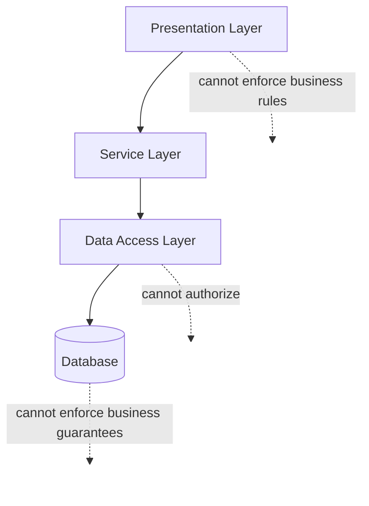

# Diagram: System Architecture

[← Back to diagrams index](README.md) · [Owning document: 02-system-architecture.md](../docs/02-system-architecture.md)

A visual rendering of the layered architecture argued for in [`02-system-architecture.md`](../docs/02-system-architecture.md) — four layers, three forward dependencies, and three explicit refusals. Every element here corresponds to something that document argues for directly; nothing here introduces a new claim.

---

## The Diagram

---

## How to Read This Diagram

- The three solid arrows are the only path a request ever takes — Presentation calls Service, Service calls Data Access, Data Access calls the Database, and never in the other direction. This one-directional flow is [Dependency Direction](../docs/02-system-architecture.md#6-dependency-direction) made visual.
- The three dotted "cannot" edges are not weaker versions of the solid arrows — they're refusals, and they matter as much as the arrows themselves. A layer that *could* make a decision it isn't supposed to make is a guarantee waiting to be quietly bypassed, per [Architectural Constraints](../docs/02-system-architecture.md#7-architectural-constraints).
- Notice what's absent: there is no arrow from Presentation directly to Data Access, and no arrow from the Database back up to anything. Every guarantee this repository describes depends on that absence holding.

---

## Related Documents

- [`02-system-architecture.md`](../docs/02-system-architecture.md) — the full argument this diagram visualizes.
- [`05-design-decisions.md`](../docs/05-design-decisions.md), [ADR-001](../docs/05-design-decisions.md#adr-001--layered-server-rendered-architecture) — why this shape was chosen at all.
- [`06-architecture-trade-offs.md`](../docs/06-architecture-trade-offs.md) — what this architecture's discipline costs.
