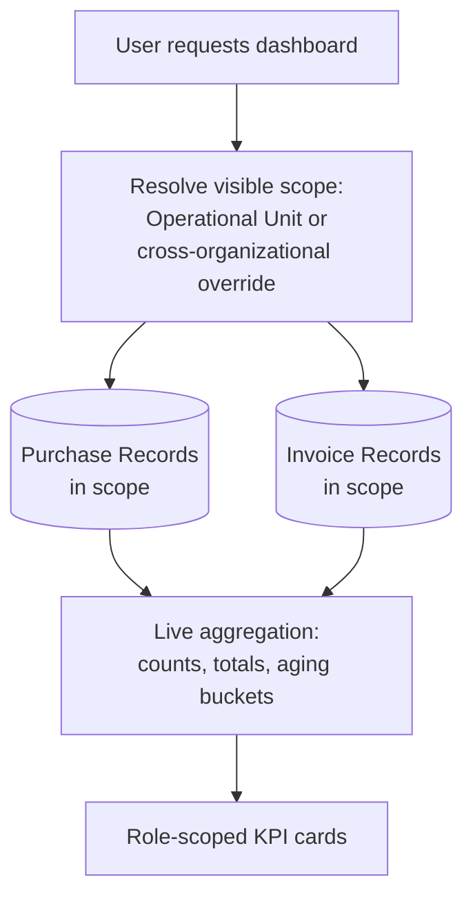

# Diagram: Dashboard Data Flow

[← Back to diagrams index](README.md) · [Owning document: 07-scalability.md](../docs/07-scalability.md)

How the same transactional data that Purchase Records and Invoice Records are built from gets aggregated, live, into a role-scoped dashboard view — [ADR-008](../docs/05-design-decisions.md#adr-008--on-demand-dashboard-aggregation).

---

## The Diagram

---

## How to Read This Diagram

- The dashboard owns no data of its own. Every number it shows is aggregated, at request time, from the same Purchase and Invoice Records described everywhere else in this repository — see [What the Dashboard Is Actually For](../docs/03-business-workflows.md#6-what-the-dashboard-is-actually-for).
- Scope resolution happens *before* aggregation, not after — a user only ever aggregates over records they're already permitted to see, per the Entitlement model in [`security-flow.md`](security-flow.md). The dashboard doesn't compute broadly and then filter; it never touches out-of-scope data in the first place.
- There is no cache or summary table anywhere in this diagram, on purpose. [Scalability, Section 2](../docs/07-scalability.md#2-computed-state-at-scale) explains exactly what that costs, and what a safe cache would look like without abandoning this diagram's shape.

---

## Related Documents

- [`03-business-workflows.md`](../docs/03-business-workflows.md), [Section 6](../docs/03-business-workflows.md#6-what-the-dashboard-is-actually-for) — why the dashboard is a summary of the reconciliation model, not a separate feature.
- [`05-design-decisions.md`](../docs/05-design-decisions.md), [ADR-008](../docs/05-design-decisions.md#adr-008--on-demand-dashboard-aggregation) — why aggregation happens live rather than being precomputed.
- [`07-scalability.md`](../docs/07-scalability.md), [Section 2](../docs/07-scalability.md#2-computed-state-at-scale) — the cost of this diagram's shape at volume, and how to cache it safely.
