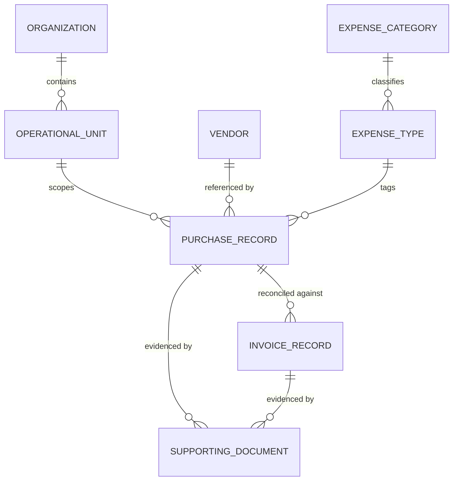

# Diagram: Domain Entity Relationships

[← Back to diagrams index](README.md) · [Owning document: 01-business-domain.md](../docs/01-business-domain.md)

Every entity from [`01-business-domain.md`](../docs/01-business-domain.md), with its relationships to the others. This is a conceptual model — it shows what relates to what and why, not a storage schema.

---

## The Diagram

---

## How to Read This Diagram

- **Vendor, Expense Category, and Expense Type** are master data — few in number, edited rarely, referenced by many Purchase Records at once. **Purchase Record, Invoice Record, and Supporting Document** are transactional data — created constantly, each owned by whoever created it. [Master Data, Transactional Data, and the Line Between Them](../docs/01-business-domain.md#3-master-data-transactional-data-and-the-line-between-them) is the argument behind that split; this diagram just shows where the line falls structurally.
- The single most important relationship in the whole diagram is **Purchase Record to Invoice Record** — a one-to-many relationship that isn't just structural, it's the relationship the entire financial invariant is checked against. See [ADR-002](../docs/05-design-decisions.md#adr-002--application-layer-financial-invariant-enforcement).
- Purchase Record connects to Vendor and Expense Type by reference, not by copy — there's no separate "snapshot" entity here. That absence is deliberate, and it's exactly why master data needs its own change history: see [Reference by Identity, Not by Copy](../docs/01-business-domain.md#5-reference-by-identity-not-by-copy).
- Organization and Operational Unit form a two-level hierarchy that scopes visibility, not a data dependency in the same sense as the others — no Purchase Record's *correctness* depends on its Operational Unit, only who's allowed to see it.

---

## Related Documents

- [`01-business-domain.md`](../docs/01-business-domain.md) — the full entity definitions and the reasoning behind each relationship.
- [`03-business-workflows.md`](../docs/03-business-workflows.md) — how the Purchase Record ↔ Invoice Record relationship behaves over time.
- [`05-design-decisions.md`](../docs/05-design-decisions.md), [ADR-004](../docs/05-design-decisions.md#adr-004--reference-data-gets-history-transactional-data-doesnt) — why master and transactional data are treated asymmetrically.
