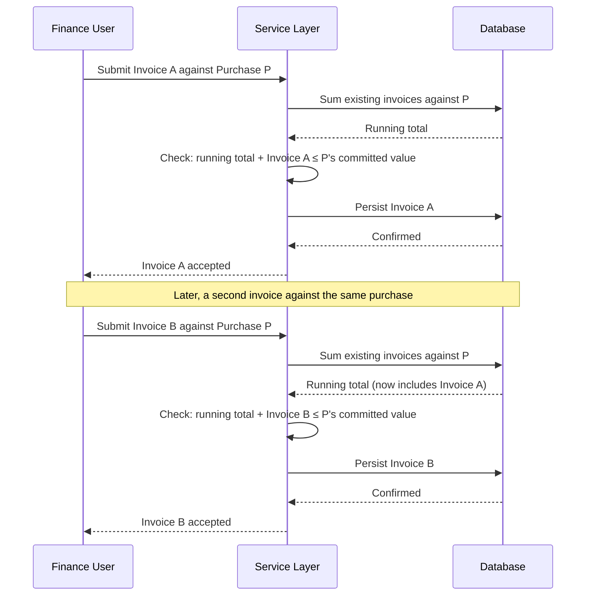

# Diagram: Reconciliation Sequence

[← Back to diagrams index](README.md) · [Owning document: 05-design-decisions.md](../docs/05-design-decisions.md)

The financial invariant from [ADR-002](../docs/05-design-decisions.md#adr-002--application-layer-financial-invariant-enforcement), shown as a sequence over time rather than a flowchart — including the concurrency gap that same ADR names as an honest, unresolved cost.

---

## The Diagram

---

## How to Read This Diagram

- The check and the write happen inside the same transaction boundary, deliberately — see [Transaction Boundaries](../docs/02-system-architecture.md#5-transaction-boundaries). Nothing in this sequence allows a state where Invoice A is "checked but not yet saved."
- This diagram shows the sequence exactly as it behaves when invoices arrive one at a time, in order. It deliberately does **not** show what happens if Invoice A and Invoice B are submitted concurrently, close enough together that each reads a running total that doesn't yet include the other — that scenario is the honest, named gap in [ADR-002's trade-offs](../docs/05-design-decisions.md#adr-002--application-layer-financial-invariant-enforcement) and [Lessons Learned, Section 2](../docs/08-lessons-learned.md#2-the-concurrency-gap). A diagram of that failure mode would look identical to this one until the very last step, which is exactly why the gap is easy to miss without reading the prose.
- Every "Sum existing invoices" step re-derives the running total from the database at that moment — there is no cached running total carried between requests. This is the same Computed State principle from [`state-machine.md`](state-machine.md), applied to an aggregate rather than a single record's status.

---

## Related Documents

- [`05-design-decisions.md`](../docs/05-design-decisions.md), [ADR-002](../docs/05-design-decisions.md#adr-002--application-layer-financial-invariant-enforcement) — the full decision, alternatives, and trade-offs behind this sequence.
- [`08-lessons-learned.md`](../docs/08-lessons-learned.md), [Section 2](../docs/08-lessons-learned.md#2-the-concurrency-gap) — the concurrency gap this diagram deliberately doesn't show.
- [`workflow.md`](workflow.md) — the same reconciliation process, shown as a flow rather than a sequence.
