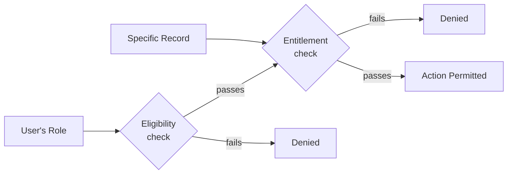

# Diagram: Two-Layer Authorization

[← Back to diagrams index](README.md) · [Owning document: 04-security-model.md](../docs/04-security-model.md)

The Eligibility and Entitlement checks from [`04-security-model.md`](../docs/04-security-model.md), shown as a single flow. This diagram answers what decisions exist, not where in the codebase they're made — [`architecture.md`](architecture.md) already answers where.

---

## The Diagram

---

## How to Read This Diagram

- Eligibility runs first and is cheap — it never loads a specific record, because it doesn't need one. Entitlement only runs once Eligibility has already passed, and only against a specific record already in hand. This ordering isn't arbitrary — [Two Questions, Two Checks](../docs/04-security-model.md#2-two-questions-two-checks) explains why the cheap check has to come first.
- There are two separate paths to **Denied**, not one. A request can fail for two structurally different reasons — wrong role for the feature, or wrong relationship to this specific record — and this system never collapses those into a single generic "not authorized" decision internally, even if the two failures might look identical to the end user.
- Nothing in this diagram shows *how* the system authenticates the user in the first place. That's deliberate — see [Authentication Is a Different, Solved Problem](../docs/04-security-model.md#7-authentication-is-a-different-solved-problem). This diagram starts from the assumption that identity is already known.

---

## Related Documents

- [`04-security-model.md`](../docs/04-security-model.md) — the full argument, including why Eligibility alone is structurally insufficient.
- [`05-design-decisions.md`](../docs/05-design-decisions.md), [ADR-005](../docs/05-design-decisions.md#adr-005--two-layer-authorization) — why two checks instead of one.
- [`10-engineering-patterns.md`](../docs/10-engineering-patterns.md), [Coarse-Then-Fine Authorization](../docs/10-engineering-patterns.md#4-coarse-then-fine-authorization) — this same shape, generalized beyond authorization entirely.
