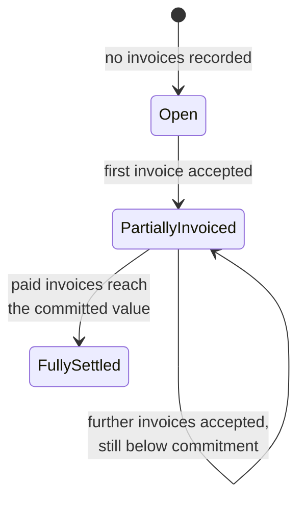
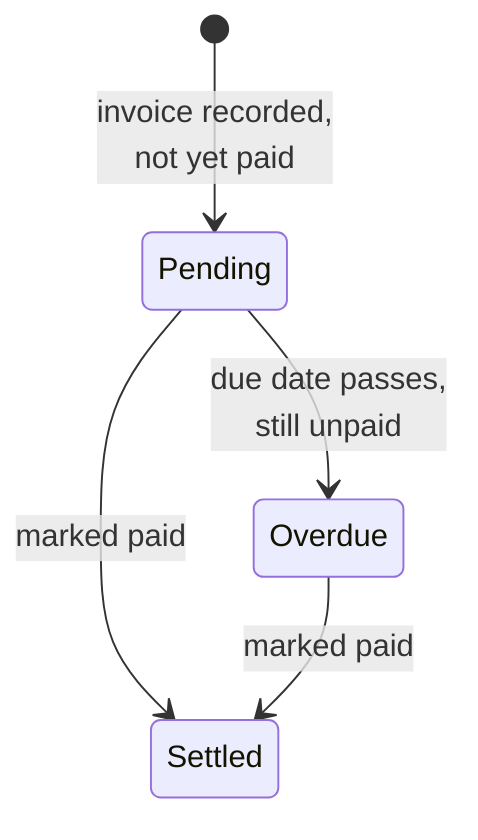

# Diagram: Computed Status States

[← Back to diagrams index](README.md) · [Owning document: 03-business-workflows.md](../docs/03-business-workflows.md)

Two small, independent state diagrams — one for a Purchase Record, one for an Invoice Record. Neither state is stored; both are computed on every read, per [ADR-003](../docs/05-design-decisions.md#adr-003--computed-status-instead-of-a-persisted-status-field). These diagrams show what the computation logically evaluates to, not a persisted transition table.

---

## Purchase Record Status

## Invoice Record Status

---

## How to Read These Diagrams

- Both diagrams look like conventional state machines, but neither is implemented as one — there's no stored "current state" field being transitioned. Every arrow represents a condition re-evaluated from source data on every read, not a write that moves a record from one box to the next. See [Status as a Question, Not a Field](../docs/03-business-workflows.md#4-status-as-a-question-not-a-field).
- The Invoice diagram's `Pending → Overdue` transition has no corresponding write operation anywhere in the system — it happens purely because a date passed. That's precisely the class of transition a persisted status field handles badly, and the reason this system doesn't use one.
- The Purchase diagram's `PartiallyInvoiced → FullySettled` transition depends on the state of *multiple* Invoice Records at once, not on the Purchase Record's own fields — the clearest possible illustration of [Relationship](../docs/glossary.md#core-engineering-concepts) as this repository uses the term.
- The two diagrams compute state differently, and that difference is itself worth noticing: Purchase state is **relational**, derived from multiple Invoice Records; Invoice state is **local**, derived only from the Invoice Record's own fields and dates. Both are Computed State, but not the same category of computation.

---

## Related Documents

- [`03-business-workflows.md`](../docs/03-business-workflows.md) — the full lifecycle these states are drawn from.
- [`05-design-decisions.md`](../docs/05-design-decisions.md), [ADR-003](../docs/05-design-decisions.md#adr-003--computed-status-instead-of-a-persisted-status-field) — why status is computed rather than stored.
- [`07-scalability.md`](../docs/07-scalability.md), [Section 2](../docs/07-scalability.md#2-computed-state-at-scale) — what computing these states on every read costs at volume.
