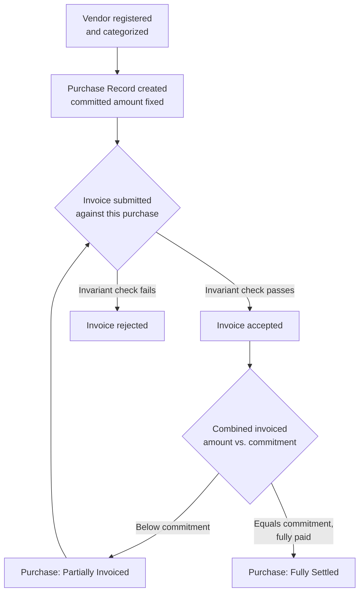

# Diagram: Purchase-to-Settlement Reconciliation Flow

[← Back to diagrams index](README.md) · [Owning document: 03-business-workflows.md](../docs/03-business-workflows.md)

The end-to-end flow from [`03-business-workflows.md`](../docs/03-business-workflows.md) — not an approval chain, a reconciliation flow. There is no human sign-off step anywhere in this diagram, which is itself the point.

---

## The Diagram

---

## How to Read This Diagram

- The loop back from **Partially Invoiced** to **Invoice submitted** is deliberate — a Purchase Record can receive zero or more Invoice Records over its lifetime, each one independently checked against the same running total. See [The Lifecycle](../docs/03-business-workflows.md#2-the-lifecycle).
- Neither **Partially Invoiced** nor **Fully Settled** is a stored value anywhere. Both are computed fresh from the invoices on every read — [ADR-003](../docs/05-design-decisions.md#adr-003--computed-status-instead-of-a-persisted-status-field). This diagram shows the *logical* flow, not a state machine with persisted transitions.
- There is no box in this diagram for "awaiting approval," "pending sign-off," or any human decision point. That's not an omission — [Why There's No Approval Gate](../docs/03-business-workflows.md#5-why-theres-no-approval-gate) explains why this system's risk is arithmetic consistency, not authorization.
- The branch at "Invoice submitted" is the financial invariant in miniature — [The Invariant, Walked Through](../docs/03-business-workflows.md#3-the-invariant-walked-through) works through this exact check with a concrete numeric example.

---

## Related Documents

- [`03-business-workflows.md`](../docs/03-business-workflows.md) — the full argument this flow visualizes.
- [`reconciliation-sequence.md`](reconciliation-sequence.md) — the same flow, shown as a sequence over time rather than a flowchart.
- [`state-machine.md`](state-machine.md) — the computed status values referenced in this diagram, shown as their own state diagrams.
