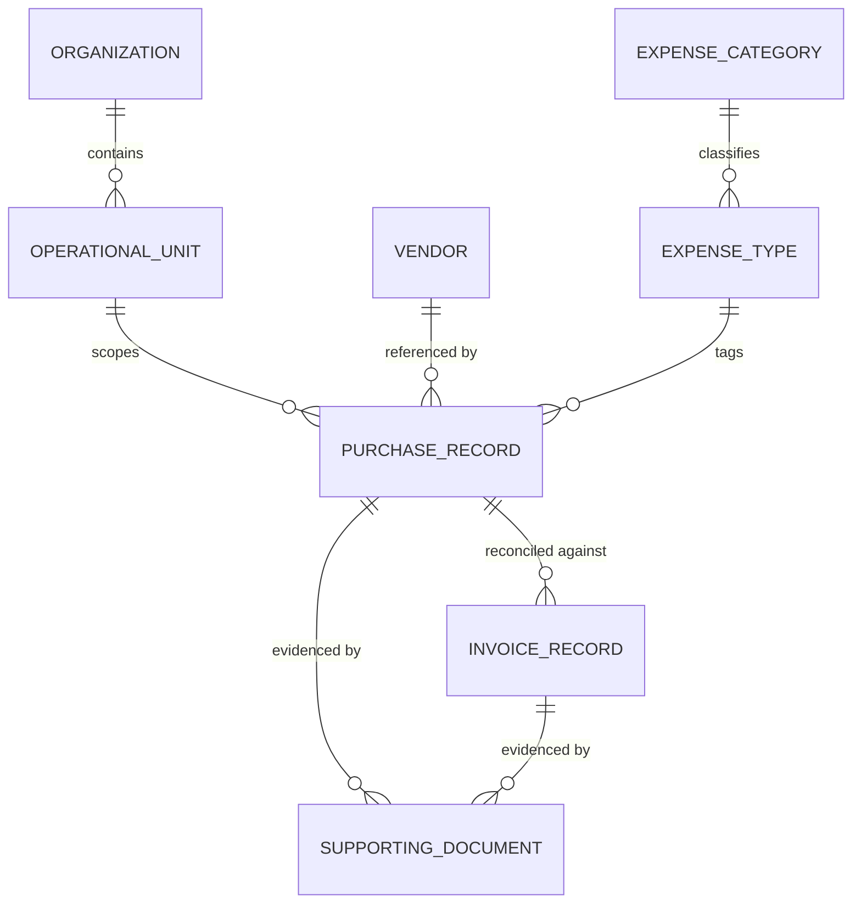

# Business Domain

[← Back to README](../README.md) · [← Previous: Overview](00-overview.md)

**Guiding question: why is this domain modeled this way?**

A domain model isn't a diagram of tables. It's a decision about which relationships must never break, which data is allowed to change quietly, and which data isn't. Every entity in this system earned its shape by answering one of those questions, not by convention. This document walks through the entities themselves, but its actual subject is the handful of structural decisions that produced them — the same decisions [Design Decisions](05-design-decisions.md) argues for and [Architecture Trade-offs](06-architecture-trade-offs.md) prices.

---

## Table of Contents

1. [The Entities](#1-the-entities)
2. [The Relationships](#2-the-relationships)
3. [Master Data, Transactional Data, and the Line Between Them](#3-master-data-transactional-data-and-the-line-between-them)
4. [The Organizational Hierarchy](#4-the-organizational-hierarchy)
5. [Reference by Identity, Not by Copy](#5-reference-by-identity-not-by-copy)
6. [What This Document Leaves Out](#6-what-this-document-leaves-out)
7. [Where to Go Next](#7-where-to-go-next)

---

## 1. The Entities

- **Vendor.** An external party the organization purchases from. Referenced, never duplicated, by every purchase made against it.
- **Expense Category** and **Expense Type.** A two-level classification purchases are tagged with — category the broader grouping, type the more specific one within it.
- **Purchase Record.** A committed amount, tied to a vendor, an expense category and type, and an organizational unit, with supporting documentation attached.
- **Invoice Record.** A claim against a specific purchase's committed amount, tracked independently toward payment.
- **Supporting Document.** Evidence attached to a purchase or invoice — a purchase order copy, a receipt, anything that substantiates the record it's attached to.
- **Organization** and **Operational Unit.** A two-level hierarchy scoping which purchases and invoices a given user can see, detailed in Section 4.

None of these seven concepts is arbitrary. Each earns its place by being something either referenced by many other records (Vendor, Expense Category, Expense Type — [Section 3](#3-master-data-transactional-data-and-the-line-between-them) explains why that matters) or something that exists to be reconciled against something else (Purchase Record and Invoice Record — the relationship [Business Workflows](03-business-workflows.md) is built around).

---

## 2. The Relationships

Two relationships carry almost all of the engineering weight in the rest of this repository. A Purchase Record can have many Invoice Records — that's the one-to-many relationship [Business Workflows](03-business-workflows.md) and [Design Decisions, ADR-002](05-design-decisions.md#adr-002--application-layer-financial-invariant-enforcement) are built entirely around, since the invariant is a statement about *all* of a purchase's invoices at once, not any single one. And a Purchase Record references — rather than copies — a Vendor and an Expense Type, which is a small modeling choice with a large consequence, covered in Section 5.

---

## 3. Master Data, Transactional Data, and the Line Between Them

Vendor, Expense Category, and Expense Type are **master data** — administered independently, edited rarely, and read by many Purchase Records at once. Purchase Record, Invoice Record, and Supporting Document are **transactional data** — created constantly, each one owned by whoever created it, and never depended on by other records the way master data is.

That distinction isn't decorative. It's the reason [ADR-004](05-design-decisions.md#adr-004--reference-data-gets-history-transactional-data-doesnt) gives master data a full change history and doesn't give one to transactional data: master data silently changing underneath many dependents is a materially more dangerous failure mode than a transactional record's own edit going untracked, because a change to a Vendor ripples to every Purchase Record that cites it, while a change to one Purchase Record affects only itself. The domain model draws this line before any code does — master data and transactional data aren't just stored differently, they're *conceptually* different kinds of things, and the storage decision only follows the conceptual one.

---

## 4. The Organizational Hierarchy

Organization and Operational Unit form a two-level hierarchy: an Operational Unit belongs to exactly one Organization, and every Purchase Record belongs to exactly one Operational Unit. This hierarchy exists for one purpose — scoping visibility, covered operationally in [Security Model](04-security-model.md) — and it's worth noting here, at the domain level, that the hierarchy is only two levels deep on purpose. A deeper hierarchy would need to answer harder questions about partial visibility across intermediate levels that this domain has never needed to answer; two levels is the shallowest hierarchy that still lets visibility be scoped meaningfully, and the domain model doesn't carry more structure than the problem requires.

---

## 5. Reference by Identity, Not by Copy

When a Purchase Record is created, it stores a reference to a Vendor and an Expense Type — their identity, not a frozen copy of what they looked like at that moment. This is a deliberate choice with a real consequence: if a Vendor's details are later edited, every Purchase Record that cites it reflects the edit, because there was never a separate copy to leave behind.

That consequence is exactly why master data earns a change history and transactional data doesn't, from [Section 3](#3-master-data-transactional-data-and-the-line-between-them) — a system that references by identity needs *some* way to answer "what did this look like before," because the current data no longer tells you. History is how this domain answers that question for the data referenced widely enough for the question to come up.

---

A domain model is ultimately a map of which relationships must survive change together — and which guarantees would break if they didn't.

---

## 6. What This Document Leaves Out

- The column-level schema, storage engine, or persistence technology behind any of these entities — this document describes the domain's shape, not its implementation.
- How each entity is actually created, validated, or reconciled over time — [Business Workflows](03-business-workflows.md) owns the lifecycle.
- Why master data gets history and transactional data doesn't, argued as a trade-off rather than described as a structural fact — that's [ADR-004](05-design-decisions.md#adr-004--reference-data-gets-history-transactional-data-doesnt) in full.

---

## 7. Where to Go Next

This document defined what exists and how it relates. The next document explains how those relationships are protected structurally.

- Continue to [`02-system-architecture.md`](02-system-architecture.md) for how these entities map onto the system's layers.
- Continue to [`03-business-workflows.md`](03-business-workflows.md) for how a Purchase Record and its Invoice Records actually move through their lifecycle.
- Continue to [`04-security-model.md`](04-security-model.md) for how the Organization/Operational Unit hierarchy scopes visibility in practice.
