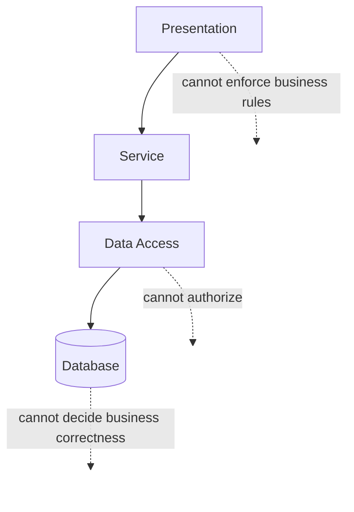

# System Architecture

[← Back to README](../README.md) · [← Previous: Design Decisions](05-design-decisions.md)

**Guiding question: why does this architecture preserve the system's guarantees?**

Architecture is not the collection of layers. It is the assignment of responsibilities between them. A system can have the same four boxes on a whiteboard as this one — presentation, service, data access, database — and still fail to protect a single guarantee, if the boxes don't agree on which of them is allowed to decide what. This document is about that agreement, not about the boxes.

---

## Table of Contents

1. [Purpose of the Architecture](#1-purpose-of-the-architecture)
2. [Architectural Principles](#2-architectural-principles)
3. [Layer Responsibilities](#3-layer-responsibilities)
4. [Request Lifecycle](#4-request-lifecycle)
5. [Transaction Boundaries](#5-transaction-boundaries)
6. [Dependency Direction](#6-dependency-direction)
7. [Architectural Constraints](#7-architectural-constraints)
8. [Why This Architecture Fits This Problem](#8-why-this-architecture-fits-this-problem)
9. [Where It Stops Scaling](#9-where-it-stops-scaling)
10. [Relationship to the ADRs](#10-relationship-to-the-adrs)
11. [What This Document Leaves Out](#11-what-this-document-leaves-out)
12. [Where to Go Next](#12-where-to-go-next)

---

## 1. Purpose of the Architecture

[ADR-001](05-design-decisions.md#adr-001--layered-server-rendered-architecture) chose a layered, server-rendered shape because this system's difficulty is correctness, not interactivity. This document exists to answer the question that choice raises immediately: correctness *of what*, enforced *where*? An architecture earns the word "layered" not by having layers, but by making sure each one owns exactly one kind of decision, and refuses to make any other kind — because the moment two layers can both make the same decision, they can eventually disagree about it, and nobody designed for that disagreement to be resolved.

The purpose of this architecture, stated plainly: put every decision in exactly one place, and make that place the only place capable of making it.

Four boxes, three arrows forward, and three refusals. The refusals matter as much as the arrows — a layer that *could* make a decision it isn't supposed to make is a guarantee waiting to be quietly bypassed.

---

## 2. Architectural Principles

Everything described in the rest of this document is a consequence of four principles. If any one of them changes, the architecture changes with it.

- **One layer, one kind of decision.** A layer that renders a view does not decide whether a number is valid. A layer that decides whether a number is valid does not decide how it's stored. Mixing these is how a system ends up with the same rule enforced twice, in two places, that quietly drift apart.
- **The layer that enforces a guarantee is the layer nothing can bypass.** A guarantee checked in a layer that can be skipped isn't a guarantee — it's a convention, and conventions get forgotten under deadline pressure. This is why [ADR-002](05-design-decisions.md#adr-002--application-layer-financial-invariant-enforcement)'s invariant lives in the service layer specifically, not in the presentation layer where a request could theoretically be crafted to skip it.
- **Dependencies point one direction.** A lower layer never knows a higher one exists. The database has no awareness of the service layer; the service layer has no awareness of what rendered the request that invoked it.
- **Transaction boundaries align with business operations, not technical convenience.** A transaction represents "this business operation happened or it didn't," never "this database call happened or it didn't" — the two sound similar and are not the same commitment.

---

## 3. Layer Responsibilities

The layers are defined less by what they do than by the decisions they are permitted to make. Four layers, each defined here by what it refuses to do as much as by what it does.

**Presentation.** Accepts a request, resolves who's making it, and hands off to the service layer. It contains no business rules and no data-integrity logic — its authorization role is limited to the coarse, route-level check; [ADR-005](05-design-decisions.md#adr-005--two-layer-authorization) is explicit that the finer, record-level check belongs one layer down, not here. If a rule can be stated as "a request either has permission to reach this feature or it doesn't," it belongs in this layer. If it requires looking at a specific record's content, it doesn't.

**Service.** Owns every business rule this repository discusses: the financial invariant from [ADR-002](05-design-decisions.md#adr-002--application-layer-financial-invariant-enforcement), the derived-status computation from [ADR-003](05-design-decisions.md#adr-003--computed-status-instead-of-a-persisted-status-field), the record-level half of authorization from ADR-005, and the transaction boundary described in Section 5 below. If a decision requires business knowledge to make correctly, it is made here and nowhere else.

**Data access.** Translates the service layer's intent ("find this," "save that") into queries and writes, and nothing more. It does not decide whether a write should be allowed — that decision has already been made one layer up by the time this layer is reached. This is a deliberate narrowing of responsibility: a layer that can't decide anything can't decide anything incorrectly.

**Database.** Stores exactly what it's told to store. It is not asked to enforce the financial invariant itself, a decision examined explicitly as a trade-off in ADR-002 — the guarantee lives one layer up, in code that can be read, tested, and reasoned about without needing to know a specific database engine's constraint syntax.

---

## 4. Request Lifecycle

A request moves through exactly one path, with no shortcuts between non-adjacent layers:

1. It arrives and is authenticated — a concern this architecture treats as a solved problem handled ahead of everything described here, not something any of these four layers reimplements.
2. The presentation layer resolves the coarse, route-level authorization question: can a user with this role reach this feature at all?
3. The service layer receives the request's intent, resolves the finer, record-level authorization question, applies every relevant business rule — including the financial invariant check where relevant — and decides what, if anything, should be persisted.
4. The data-access layer carries out exactly the reads and writes the service layer determined were necessary.
5. The response is built from what the service layer decided, and returned.

Notice what's absent from this list: at no point does the presentation layer talk to the data-access layer directly, and at no point does the database get asked to make a decision only the service layer has the context to make correctly. Every step exists because the step before it isn't allowed to do that step's job.

Every request therefore passes every guarantee through exactly one decision point. No guarantee is evaluated twice, and none can be skipped accidentally.

---

## 5. Transaction Boundaries

A transaction begins where a business operation begins and ends where it ends — never narrower, and rarely wider. When a new invoice is submitted, the check described in ADR-002 and the write that persists the invoice happen inside the same transaction, because "checked but not yet saved" and "saved but not yet checked" are both states this system refuses to let exist, even momentarily. A transaction boundary drawn around only the write — with the check happening just before, outside the boundary — would reopen exactly the gap ADR-002 exists to close: a second write could slip in between the check and the save.

This is also why transaction boundaries live in the service layer specifically. The service layer is the only layer with enough business context to know where a business operation actually starts and ends; a data-access layer drawing its own transaction boundaries would be drawing them around individual queries, not around the operation those queries are supposed to jointly represent.

---

## 6. Dependency Direction

This architecture is designed with a one-directional dependency boundary: presentation depends on service, service depends on data access, data access depends on the database — and never the reverse. Nothing lower in the stack is aware that anything higher exists.

This has a consequence worth naming explicitly: the module implementing this domain has no downstream dependents anywhere else in the systems it might sit alongside. Nothing outside it needs to know it exists in order to function. That's not an accident of scope — it's what a one-directional dependency boundary, applied consistently, produces. A module that other modules depend on has to consider its effect on them with every change; a module nothing depends on can evolve freely, constrained only by the guarantees it has already promised to preserve.

---

## 7. Architectural Constraints

Stated as refusals, because a constraint that can't be violated is worth more than a convention that merely shouldn't be:

- The presentation layer cannot make a record-level authorization decision. That decision has exactly one home, per ADR-005.
- No layer other than the service layer may decide whether a write is allowed to proceed. The financial invariant from ADR-002 has exactly one enforcement point.
- The database is never relied upon to be the source of a business decision, only the durable record of one already made.
- A computed value — a status, an aggregate — is never given a persisted twin that a separate code path is responsible for keeping in sync, per ADR-003 and [ADR-008](05-design-decisions.md#adr-008--on-demand-dashboard-aggregation).

---

## 8. Why This Architecture Fits This Problem

The problem this system solves is not "render data quickly" or "support a rich interactive experience" — [ADR-001](05-design-decisions.md#adr-001--layered-server-rendered-architecture) already ruled that framing out. The problem is "make it structurally difficult for a financial fact to become wrong, and impossible for it to become wrong invisibly." A layered architecture with strict, one-directional responsibility assignment fits that problem well for a specific reason: it minimizes the number of places a guarantee could theoretically be bypassed, by minimizing the number of layers with the authority to bypass it. A guarantee enforced in one layer, reachable through exactly one path, is a guarantee a reader can verify by reading one thing. A guarantee that could in principle be enforced by three different layers, depending on which code path handles a given request, is a guarantee nobody can verify by reading anything — they'd have to read everything, and hope nothing was missed.

This is, in the end, an unglamorous answer: the architecture fits because it is boring in exactly the way a financial system should be boring.

> Interesting architecture is usually a sign that a system is solving a problem that isn't the problem it was actually asked to solve.

---

## 9. Where It Stops Scaling

This architecture's constraints are also where its costs live: a strictly layered, server-rendered shape means every request pays the cost of passing through every layer, including read-heavy paths like the dashboard aggregation in ADR-008, where a large fraction of the total cost is unavoidable because the guarantee (always-current data) depends on visiting the same data every time. The point at which this becomes a real limitation, not just a theoretical one, is covered fully in [Scalability](07-scalability.md) — this document only needs to establish that the architecture's discipline and its performance ceiling are the same trade-off, viewed from two different angles.

---

## 10. Relationship to the ADRs

This document doesn't introduce new decisions — it shows the shape the decisions already made in [Design Decisions](05-design-decisions.md) produce when assembled together.

| Architectural fact | Comes from |
|---|---|
| A layered, server-rendered shape at all | [ADR-001](05-design-decisions.md#adr-001--layered-server-rendered-architecture) |
| The service layer owning the financial invariant, reachable through exactly one path | [ADR-002](05-design-decisions.md#adr-002--application-layer-financial-invariant-enforcement) |
| No persisted status field, and the performance consequence of computing it live | [ADR-003](05-design-decisions.md#adr-003--computed-status-instead-of-a-persisted-status-field) |
| The presentation layer's authorization role stopping at the coarse, route-level check | [ADR-005](05-design-decisions.md#adr-005--two-layer-authorization) |
| The dashboard's read paths remaining pure aggregation over authoritative data, never their own write path | [ADR-008](05-design-decisions.md#adr-008--on-demand-dashboard-aggregation) |

Read in this direction, "architecture" stops being a separate topic from "decisions" — it's what the decisions look like once they're all satisfied simultaneously.

Read in reverse, the ADRs explain why the architecture looks the way it does. Read forward, the architecture demonstrates how those decisions coexist without contradicting one another.

---

Responsibility exists so guarantees have exactly one owner.

---

## 11. What This Document Leaves Out

- *Why* each underlying decision was made — that's [Design Decisions](05-design-decisions.md)' job, not this one's.
- The specific runtime behavior of any one business operation end to end — that belongs to [Business Workflows](03-business-workflows.md).
- The full authorization model — [Security Model](04-security-model.md) owns it; this document only establishes where the two authorization checks structurally live.
- Quantified scaling thresholds — [Scalability](07-scalability.md) owns those.

---

## 12. Where to Go Next

This document explained the shape. The next two documents explain what happens inside it.

- Continue to [`03-business-workflows.md`](03-business-workflows.md) to see how a purchase and its invoices actually move through these layers over time.
- Continue to [`04-security-model.md`](04-security-model.md) for the full mechanics of the two-layer authorization this document only located structurally.
- See [`06-architecture-trade-offs.md`](06-architecture-trade-offs.md) for the tensions this architecture accepts — consistency vs. performance chief among them — treated as transferable lessons.
