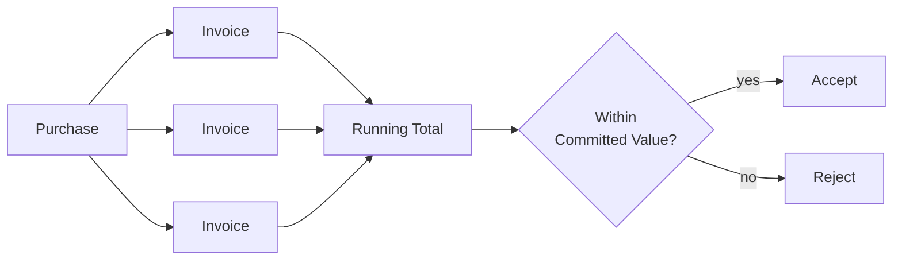

# Business Workflows

[← Back to README](../README.md) · [← Previous: System Architecture](02-system-architecture.md)

**Guiding question: why is reconciliation fundamentally harder than CRUD?**

Creating a record, reading it back, updating it, deleting it — that's a solved problem, and has been for decades. Reconciliation looks like CRUD from a distance: purchases and invoices are still just records being created and edited. What CRUD doesn't prepare you for is that none of these records are allowed to be judged correct in isolation. An invoice isn't valid or invalid on its own terms — it's only valid *in relation to every other invoice already recorded against the same purchase*, at the exact moment it's submitted. The unit of correctness isn't the record. It's the relationship between records, evaluated fresh every time one of them changes. That single fact is what this document is really about; the purchase-to-settlement sequence below is evidence for it, not the point of it.

---

## Table of Contents

1. [The Unit of Correctness Isn't the Record](#1-the-unit-of-correctness-isnt-the-record)
2. [The Lifecycle](#2-the-lifecycle)
3. [The Invariant, Walked Through](#3-the-invariant-walked-through)
4. [Status as a Question, Not a Field](#4-status-as-a-question-not-a-field)
5. [Why There's No Approval Gate](#5-why-theres-no-approval-gate)
6. [What the Dashboard Is Actually For](#6-what-the-dashboard-is-actually-for)
7. [Where Reconciliation Gets Harder Than This Document Admits](#7-where-reconciliation-gets-harder-than-this-document-admits)
8. [What This Document Leaves Out](#8-what-this-document-leaves-out)
9. [Where to Go Next](#9-where-to-go-next)

---

## 1. The Unit of Correctness Isn't the Record

A CRUD system validates a record against itself: is this field present, is this number positive, is this reference to another table valid. Every one of those checks can be answered by looking at exactly one row.

A reconciliation system has to answer a different kind of question: given everything else already recorded, is *this* new fact still true? An invoice for a given amount might be perfectly well-formed — every field present, every reference valid — and still be wrong, because accepting it would mean the business has now claimed more against a purchase than the purchase was ever worth. No single-row validation catches that. It requires looking sideways, at siblings, not just inward, at itself.

That's the entire difficulty of reconciliation in one sentence: correctness is a property of a *set* of records, not any one of them, and the set keeps changing. Every section that follows is simply a consequence of that one observation.

---

## 2. The Lifecycle

A vendor is registered once, categorized under an expense category and type, and then referenced — never copied — by every purchase made against it. A purchase establishes a financial commitment, tied to that vendor, an expense category, and an organizational unit, with supporting documentation attached. From there:

1. **Open.** A purchase exists with no invoices against it yet. Nothing has been claimed against the commitment.
2. **Partially invoiced.** One or more invoices have been recorded, and their combined amount is less than the purchase's committed value. The commitment is partially, not fully, accounted for.
3. **Fully settled.** The combined amount of invoices against the purchase — specifically, the ones marked paid — has reached the committed value. Nothing more should ever be claimed against this purchase.

None of these three words exist as a stored value anywhere. They're the answer to a question asked fresh every time — see [Section 4](#4-status-as-a-question-not-a-field). An invoice, independently, moves through its own much simpler question: has it been paid, and if not, is it past its due date. Two lifecycles, evaluated independently, but the purchase's lifecycle is only ever a summary of what its invoices' lifecycles add up to.

Notice that nothing in this lifecycle describes how a record is stored or who is allowed to create it. Those are architectural and security questions. This section only establishes how financial facts accumulate over time.

---

## 3. The Invariant, Walked Through

Every invoice feeds the same running total; the total, not any single invoice, is what gets checked. Consider a purchase committed for a fixed amount. Say, for illustration, $10,000 — an arbitrary number, chosen only to make the sequence concrete, not drawn from any real transaction.

An invoice for $4,000 is submitted against it. The system doesn't just check that $4,000 is a valid amount — it sums every invoice already recorded against this same purchase (there are none yet), adds the new one, and confirms $4,000 does not exceed $10,000. It's accepted. The purchase is now partially invoiced.

A second invoice for $6,000 arrives. The same check runs: existing total ($4,000) plus this new invoice ($6,000) equals exactly $10,000 — at the boundary, not over it. Accepted. Once both are eventually marked paid, the purchase reaches fully settled.

Now imagine a third invoice, for even $1, arrives afterward against the same purchase. The same check runs: $10,000 already recorded, plus $1, exceeds the $10,000 commitment. Rejected — not because $1 is an invalid amount in isolation, but because *this specific purchase* has no room left for it. The same $1 invoice, submitted against a different purchase with remaining headroom, would be accepted without complaint. Its validity was never a property of the number by itself.

This is [ADR-002](05-design-decisions.md#adr-002--application-layer-financial-invariant-enforcement) in motion — checked synchronously, at the moment of submission, never after the fact.

An invariant therefore doesn't validate a record. It validates the effect that record would have on the rest of the system.

---

## 4. Status as a Question, Not a Field

Every status mentioned in Section 2 is computed, never stored — the reasoning is [ADR-003](05-design-decisions.md#adr-003--computed-status-instead-of-a-persisted-status-field)'s. What's worth adding here is *why* that matters specifically for reconciliation, rather than being a generic architectural preference: a purchase's status is a summary of its invoices, and invoices change independently of the purchase record itself — a payment gets recorded, a due date passes. If status were a field on the purchase, every one of those independent changes would need to remember to walk back up and update it. Treating status as a question instead of a field means there's no "walking back up" to forget — the answer is simply recomputed, correctly, from whatever the current facts are, no matter which of several possible changes was the one that most recently happened.

An invoice's own status works the same way, for a smaller reason: whether it's overdue depends on today's date, and no write operation happens merely because a day passed. A stored field would need something to update it purely on the calendar's schedule. A computed answer doesn't.

---

## 5. Why There's No Approval Gate

It's worth being explicit about what this system is not, because the shape of an approval-oriented system is a familiar one and it's easy to assume this is a smaller version of it. It isn't. [ADR-009](05-design-decisions.md#adr-009--no-multi-level-approval-gate) explains the reasoning in full; the short version is a difference in the question being asked:

> **An approval answers "should this happen?"**
> **An invariant answers "can these facts still all be true together?"**

A system built around human sign-off is answering the first question. This system answers only the second, and answers it exactly, every time — a chain of approvers doesn't make arithmetic more correct any more than an invariant check makes someone more entitled to spend money. The two problems look adjacent. They aren't the same problem, and conflating them is how a system ends up with an approval chain that provides a false sense of security about a risk it was never actually checking.

---

## 6. What the Dashboard Is Actually For

The dashboard is the reconciliation model viewed from farther away. It is not a separate reporting feature bolted onto the transactional model — it's the same set of facts from Sections 2 through 4, aggregated across every purchase and invoice a user is scoped to see, live, per [ADR-008](05-design-decisions.md#adr-008--on-demand-dashboard-aggregation). Its purpose in the reconciliation story specifically is to answer the question no single record can answer on its own: not "is this purchase settled," but "across everything I'm responsible for, how much remains unsettled, and how much of that is now overdue." That's a question about the *set* again — the same shift in unit of correctness from Section 1, applied to visibility instead of validation.

---

## 7. Where Reconciliation Gets Harder Than This Document Admits

Section 3 walked through the invariant as if invoices arrive one at a time, in order, with nothing else happening in between. In practice, nothing guarantees that. Two invoices against the same purchase, submitted close enough together, can each independently observe a total that doesn't yet include the other — and each pass its own check honestly, while together violating the commitment neither one violated alone. This is the same concurrency gap named plainly in ADR-002's trade-offs, and it's the clearest illustration in this entire system of why reconciliation is harder than CRUD in a way that's easy to miss until it's pointed out: the invariant isn't just "harder to check," it's a check whose correctness depends on *when* it's asked, not just *what* it's asked about. [`06-architecture-trade-offs.md`](06-architecture-trade-offs.md) generalizes this tension; [`08-lessons-learned.md`](08-lessons-learned.md) discusses it as an honest, unresolved cost rather than a solved problem. The purpose of this repository is to make those limits visible, not invisible.

---

Everything in this document ultimately comes back to one idea: financial correctness is a property of relationships, not records.

---

## 8. What This Document Leaves Out

- *Why* the invariant is enforced at the application layer rather than the database — that's [ADR-002](05-design-decisions.md#adr-002--application-layer-financial-invariant-enforcement)'s answer, not this document's to repeat.
- The mechanics of the two-layer authorization that determines who can even reach these operations — [`04-security-model.md`](04-security-model.md).
- Master data — vendors, expense categories and types — and why they carry a change history that purchases and invoices don't — [`01-business-domain.md`](01-business-domain.md).
- The performance cost of computing status and aggregates live, at scale — [`07-scalability.md`](07-scalability.md).

---

## 9. Where to Go Next

This document explained why reconciliation is a harder problem than it looks. The next documents explain how the system protects against getting it wrong, and what it costs to do so.

- Continue to [`04-security-model.md`](04-security-model.md) for who is allowed to create and view these records in the first place.
- Continue to [`06-architecture-trade-offs.md`](06-architecture-trade-offs.md) for the concurrency tension named in Section 7, generalized beyond this specific system.
- Continue to [`01-business-domain.md`](01-business-domain.md) for how vendors, categories, and organizational units relate to the purchases and invoices described here.
