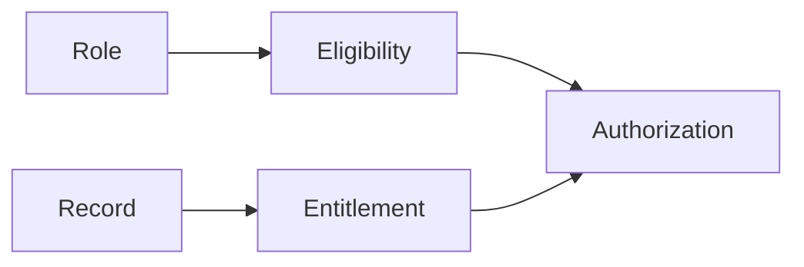

# Security Model

[← Back to README](../README.md) · [← Previous: Business Workflows](03-business-workflows.md)

**Guiding question: why is role-based access structurally insufficient?**

A role tells you what kind of operations someone may perform. A relationship tells you whether they may perform that operation on this specific record. Those are two different questions, and a system that only ever asks the first one has a gap in it — not a bug, a gap, present by construction, invisible until someone happens to test for it. This document is about why that gap exists in any role-only system, and how this one closes it.

---

## Table of Contents

1. [The Question a Role Can't Answer](#1-the-question-a-role-cant-answer)
2. [Two Questions, Two Checks](#2-two-questions-two-checks)
3. [Where Each Check Lives](#3-where-each-check-lives)
4. [Roles, as Evidence](#4-roles-as-evidence)
5. [The Visibility Override, as Evidence](#5-the-visibility-override-as-evidence)
6. [Where the Two Checks Can Quietly Drift Apart](#6-where-the-two-checks-can-quietly-drift-apart)
7. [Authentication Is a Different, Solved Problem](#7-authentication-is-a-different-solved-problem)
8. [What This Document Leaves Out](#8-what-this-document-leaves-out)
9. [Where to Go Next](#9-where-to-go-next)

---

## 1. The Question a Role Can't Answer

Say a role grants "can view invoices." That's a true statement about a *kind* of thing — invoices, as a category. It says nothing about a specific invoice, because a role is defined independently of any particular record; it was assigned before that invoice existed and will still apply after it's gone.

Now ask a sharper question: can this specific person view *this* invoice? A role can't answer that on its own, because the answer depends on something the role doesn't know about — who created this invoice, which organizational unit it belongs to, whether this person has any legitimate relationship to it at all. The role establishes eligibility for a category of action. It cannot establish entitlement to a specific instance of it, because it was never given the information to.

This isn't a flaw in any particular role system. It's a structural fact about what a role *is*: a statement about a category, asked to answer a question about a member of that category. The gap between those two things doesn't close by adding more roles, or more granular roles, or roles scoped more narrowly — a role, however narrow, is still a statement about a category. Authorization therefore isn't one increasingly detailed question. It's two fundamentally different questions.

---

## 2. Two Questions, Two Checks

Every authorization decision in this system is the product of two questions, always asked in this order — worth naming so the rest of this repository can refer back to them rather than re-describing them each time:

**Question 1 — Eligibility.** Can a user with this role reach this feature at all? A coarse, cheap, role-based check — resolved without loading any specific record, because it doesn't need one. This is the question a role is actually built to answer.

**Question 2 — Entitlement.** Does this specific user have a legitimate relationship to this specific record? A narrower, more expensive check, resolved only once a specific record is already in hand — ownership, scope, or an explicit visibility grant, depending on the case.

Both questions get asked, in that order, for a reason: **Eligibility** is cheap and eliminates most illegitimate requests before anything expensive happens; **Entitlement** is precise and is only worth paying for once a plausible, specific record is on the table. Answering only the Eligibility question and treating it as sufficient is precisely the mistake Section 1 describes — mistaking Eligibility for Entitlement.

---

## 3. Where Each Check Lives

[`02-system-architecture.md`](02-system-architecture.md) already located these structurally: the first question belongs to the presentation layer, the second to the service layer, and [ADR-005](05-design-decisions.md#adr-005--two-layer-authorization) is the decision that put them there rather than combining them into one check in one place. That separation is doing real work, and it's worth restating why here rather than assuming it's obvious: a check that can answer "may this role use this feature" cheaply is a check that doesn't need to load a specific record — the moment it starts asking about a specific record's ownership, it has stopped being the cheap check and has become the expensive one, just performed in the wrong layer, at the wrong stage, possibly on requests that were never going to be legitimate at the coarse level in the first place.

Keeping the two checks in two different layers isn't a stylistic preference. It's what keeps each one honest about which question it's actually answering. A layer cannot answer a question it was never given enough information to answer.

---

## 4. Roles, as Evidence

This system defines a handful of roles — an administrative role with unrestricted visibility, a role scoped to managing reference data, and a standard role scoped to a user's own records within their organizational unit. None of that is the point of this document; it's the evidence for Section 1's claim. Every one of these roles answers exactly one question — "what category of operation can this person attempt" — and none of them, on their own, answers "on which specific records." A user holding the standard role can attempt to view an invoice. Whether they're allowed to view *this* invoice is a question the role was never positioned to answer, which is exactly why Section 2's second check exists independently of which role granted the first.

---

## 5. The Visibility Override, as Evidence

[ADR-006](05-design-decisions.md#adr-006--identity-based-visibility-overrides) is worth revisiting here specifically because it's the case that makes Section 1's distinction concrete rather than abstract. A small number of individuals are granted visibility across organizational boundaries the standard role hierarchy doesn't cross — not by inventing a new role, but through an explicit, identity-based grant. That's not a role answering a relationship question more broadly. It's a deliberate, narrow expansion of *whose* relationships count as legitimate for a specific set of records, granted to specific people rather than to a category. The fact that this had to be solved as a relationship-level concern, not a role-level one, is itself evidence for this document's thesis: even the exception to the normal visibility rule couldn't be expressed as a role, because **the thing being granted was never a category of operation. It was a relationship to records.**

---

## 6. Where the Two Checks Can Quietly Drift Apart

Two checks that are supposed to run together can, in practice, be applied inconsistently — one execution path gets both, another gets only the first, because "it's just a read" or because it was built at a different time by someone reasoning from a different assumption. When that happens, the coverage gap Section 2 exists to close reopens, and it reopens somewhere specific and predictable: on paths that only ever answer the coarse question and never ask the record-level one. This is not a hypothetical failure mode particular to this system — it's one of the most common, quietly-introduced authorization gaps in software generally, precisely because a missing second check produces no error, no crash, no symptom at all. The request succeeds. It just succeeds for someone it shouldn't have. [`06-architecture-trade-offs.md`](06-architecture-trade-offs.md) treats this as a named, recurring engineering tension rather than a one-off risk, because it is one.

---

## 7. Authentication Is a Different, Solved Problem

Everything above assumes the system already knows *who* is making a request — that identity has been established, a session or credential verified, before either of Section 2's two questions is even asked. This document deliberately has nothing to say about how that verification happens. Authentication answers "who is this," a genuinely different question from "what may they do" and "on what may they do it," and treating all three as one undifferentiated concern is its own way of losing the distinction this whole document is built around. Authentication is assumed solved, upstream, by the time either authorization question gets asked.

---

Authorization is not one question answered thoroughly. It's two different questions, asked in the right order, by the layers actually positioned to answer them.

---

## 8. What This Document Leaves Out

- How authentication itself is implemented — treated in Section 7 as a solved, upstream concern this document doesn't own.
- The full layer-responsibility argument for *why* these two checks belong in different layers — that's [`02-system-architecture.md`](02-system-architecture.md)'s job; this document only applies its conclusion.
- The full reasoning behind the visibility override, including its cost and when it stops being appropriate — that's [ADR-006](05-design-decisions.md#adr-006--identity-based-visibility-overrides) in full.
- Performance characteristics of the record-level check at scale — [`07-scalability.md`](07-scalability.md).

---

## 9. Where to Go Next

This document explained why authorization needs two different questions, not a better version of one. The next documents generalize that idea and examine what it costs.

- Continue to [`06-architecture-trade-offs.md`](06-architecture-trade-offs.md) for the coverage-gap tension named in Section 6, treated as a transferable engineering lesson.
- Continue to [`07-scalability.md`](07-scalability.md) for what the record-level check costs as request volume grows.
- Revisit [ADR-005](05-design-decisions.md#adr-005--two-layer-authorization) and [ADR-006](05-design-decisions.md#adr-006--identity-based-visibility-overrides) for the decisions this document treated as evidence.
